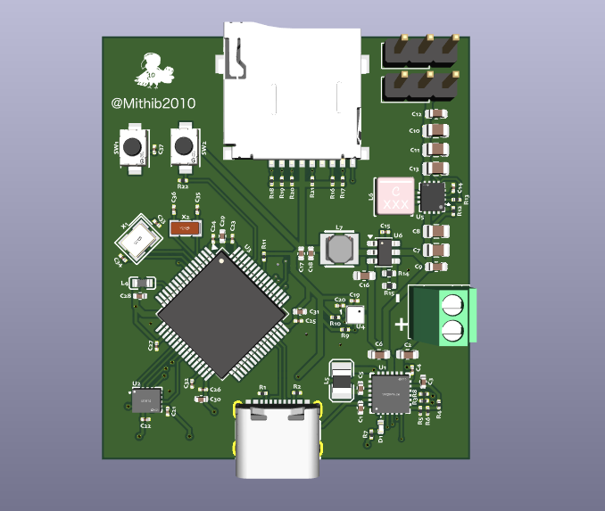

# Rocket Flight Controller

This is my **custom rocket flight controller** that I designed from scratch. I followed a flight controller guide and **added all the optional parts to make the board nicer, safer, and more reliable**.

This board is made for **rockets**, not drones.

---

## What This Board Does

This flight controller handles the main electronics needed for a rocket:

- Controls servos (for fins or thrust vector control)
- Measures movement and rotation with an IMU
- Measures altitude using a pressure sensor
- Logs flight data to a microSD card
- Uses USB-C for programming and power
- Charges a 2-cell LiPo battery
- Provides stable 5V and 3.3V power

I included **all optional components** like LEDs, crystals, pull-up resistors, and protection parts so the board works more reliably and is easier to debug.

---

## Main Parts Used

- **Microcontroller:** STM32F722RET6  
- **IMU:** ICM-45686 (SPI)  
- **Pressure Sensor:** BMP580 (I2C)  
- **Storage:** microSD card (SDMMC)  
- **Battery Charger:** BQ25883 (2S LiPo)  
- **5V Regulator:** TPS63070  
- **3.3V Regulator:** LMR51430  
- **USB:** USB-C  

---

## Schematics

### Power Section

### Sensors and Storage

---

## Final Design

---

## Bill of Materials (BOM)

| Part | What it is | Package | Notes |
|----|----|----|----|
| STM32F722RET6 | Main microcontroller | LQFP-64 | Runs all code |
| ICM-45686 | IMU | QFN | Motion sensing |
| BMP580 | Pressure sensor | LGA | Altitude |
| TPS63070 | 5V regulator | QFN | Servo power |
| LMR51430 | 3.3V regulator | SOT | Logic power |
| BQ25883 | 2S battery charger | QFN | USB charging |
| microSD socket | Data storage | SMD | Flight logs |
| USB-C connector | Power + data | SMD | Programming |
| Status LED | Indicator | 0402 | Optional (added) |

---

## PCB and Manufacturing

The PCB was designed in **KiCad**. I paid attention to power routing, grounding, and sensor placement to reduce noise and make the board more reliable.

### JLCPCB

The board was prepared for manufacturing with **JLCPCB**.

- 2-layer PCB  
- Parts chosen from LCSC  
- Designed to be easy to assemble  

---

## Extra Notes

- USB data lines are length-matched  
- SD card has the required pull-ups  
- External crystals are used for better timing  
- All optional parts were added on purpose  
